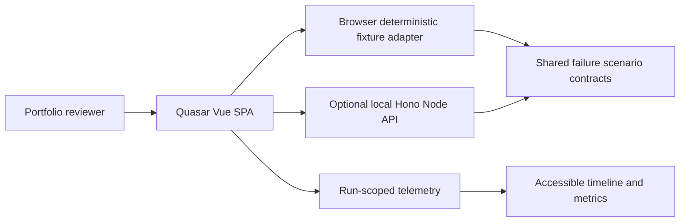

# System context

```mermaid
flowchart LR
  Reviewer[Portfolio reviewer] --> SPA[Quasar Vue SPA]
  SPA --> Browser[Browser deterministic fixture adapter]
  SPA --> Local[Optional local Hono Node API]
  Browser --> Shared[Shared failure scenario contracts]
  Local --> Shared
  SPA --> Telemetry[Run-scoped telemetry]
  Telemetry --> UI[Accessible timeline and metrics]
```

The public Pages site uses the deterministic browser adapter and does not require the local API.
